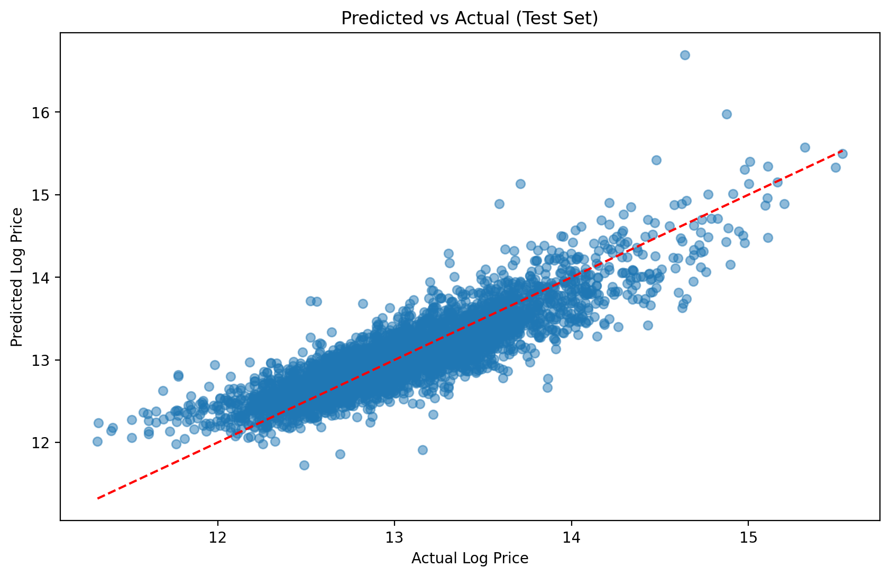
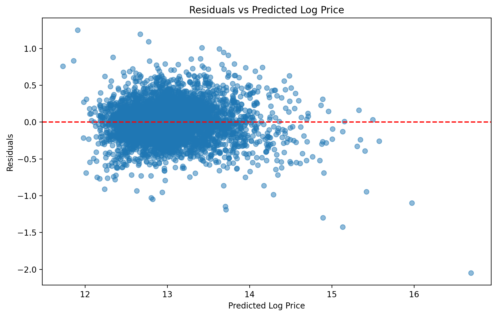
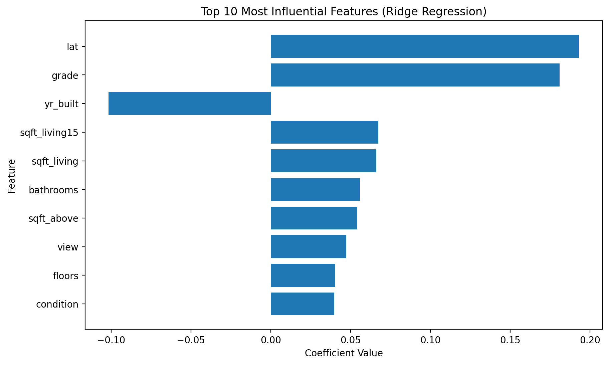

# House Price Prediction

## Business Context

A Real Estate Investment Trust (REIT) aims to invest in residential properties and needs a reliable way to estimate house prices based on structural and location-related features.

## Objective

Develop and evaluate regression models to predict housing prices and identify the most influential features.

## Key results

The final tuned Ridge regression model achieved the following performance on the test set:

```
| Metric | Value |

|------|------|
| R²  | ~0.77 |
| MAE | ~0.196 |
| RMSE | ~0.256 |
```

The results indicate that the model explains approximately **77% of the variance in housing prices** and provides reasonably accurate predictioons for unseen data.

## Model Diagnostics

### Predicted vs Actual

This plot compares  the predicted log house prices with the actual values from the test set.



The points are concentrated arround the diagonal lina, indicating that the model predictions follow the true values closely.

---

### Residual Plot

Residuals represent the difference between actual and predicted values.



The residuals are randomly scattered arround zero, suggesting that the model errors do not show strong systematic patterns.

### Feature Importance

The following plot shows the most influential features used by the tuned Ridge regression model.



Location-related variables and construction quality appear to have the strongest impact on predicted house prices.

## Dataset

King Contry House Sales dataset (downloaded from Kaggle).
The dataset is not included in this repository.

## Project structure

```
house-price-prediction/
│
├── data/
│   └── raw/                      # Kaggle dataset (not tracked by git)
│       └──house_data.csv
|
├── notebooks/
│   ├── 01_data_cleaning.ipynb
│   ├── 02_exploratory_data_analysis.ipynb
│   ├── 03_model_development.ipynb
│   └── 04_evaluation_refinement.ipynb
|
└── reports/
|   └── figures/                # exported plots (PNG)
|       ├── predicted_vs_actual_test.png
|       ├── residual_plot_test.png
|       └── top_features_ridge.png
|
├──src
|
├── README.md
├── .gitignore
```
## Models

The following regression models were evaluated:

- Linear Regression (baseline model)
- Ridge Regression (L2 REGULARIZATION)
- Lasso Regression (L1 regularization)

Hyperparameter tuning was performed using **GridSearchCV** to optimize the regularization parameter for the Ridge model.

## Results

The final tuned Ridge regression model achieved an R² score of approximately **0.77** on the test dataset, indicating that the model explains a significant portion of the variance in hpusing prices.

Model diagnostics and residual analysis suggest that the model predictions are reasonably accurate and do not show strong systematic errors.

Feature importance analysis indicates that **location (lat)** and **construction quality (grade)** are among the most influential predictors of house prices.

## Technologies Used

- Python
- Pandas
- NumPy
- Scikit-learn
- Matplotlib
- Jupyter Notebook